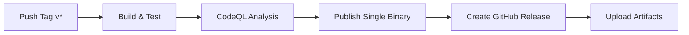

# Release Process

## Version Numbering

Follows [Semantic Versioning](https://semver.org/):
```
MAJOR.MINOR.PATCH

MAJOR - Breaking changes
MINOR - New features (backward compatible)
PATCH - Bug fixes
```

Examples:
- `v0.1.0` - Initial skeleton
- `v0.2.0` - EC fan control write implemented
- `v0.3.0` - Single-binary architecture (merged service into GUI)
- `v1.0.0` - First stable release

## Pre-release Versions

- `v0.3.0-alpha.1` - Early testing
- `v0.3.0-beta.1` - Feature complete
- `v0.3.0-rc.1` - Release candidate

## Release Checklist

### Before Release
- [ ] All tests pass
- [ ] CodeQL scan clean
- [ ] Update `CHANGELOG.md`
- [ ] Update version in:
  - [ ] `TPFan.GUI/TPFan.GUI.csproj`
  - [ ] `TPFan.Shared/TPFan.Shared.csproj`
  - [ ] `README.md` (if needed)
- [ ] Test on T480 hardware (if applicable)
- [ ] Create PR to `main`
- [ ] Get review approval
- [ ] Merge to `main`

### Create Release
- [ ] Create git tag: `git tag v0.3.0`
- [ ] Push tag: `git push origin v0.3.0`
- [ ] Wait for GitHub Actions to complete
- [ ] Verify artifacts uploaded
- [ ] Edit release notes (auto-generated)
- [ ] Publish release

### After Release
- [ ] Update GitHub Discussions
- [ ] Close related issues
- [ ] Announce if major release
- [ ] Update documentation

## Automated Release

When you push a tag `v*`:



The workflow builds `TPFan.GUI` as a single self-contained executable (`TPFan.GUI.exe`) with `inpoutx64.dll` bundled inside.

## Hotfix Process

For critical bugs in production:

1. Create branch from tag:
   ```bash
   git checkout v0.3.0
   git checkout -b hotfix/v0.3.1
   ```

2. Fix the bug

3. Update version to `v0.3.1` in:
   - `TPFan.GUI/TPFan.GUI.csproj`
   - `TPFan.Shared/TPFan.Shared.csproj`

4. Create PR to `main`

5. Tag and release

## Rollback

If release has critical issues:

1. Go to Releases page
2. Find problematic release
3. Click "Delete" (keeps tag)
4. Delete the tag:
   ```bash
   git push --delete origin v0.3.0
   ```

5. Fix issue and re-release